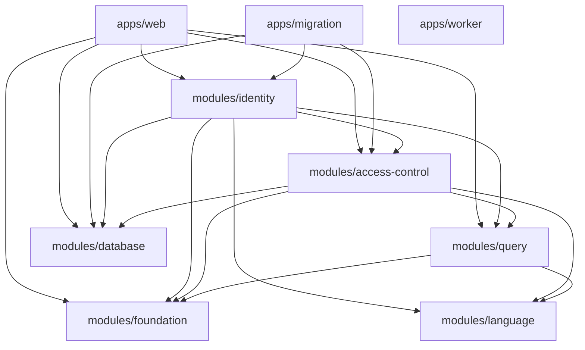

# ADR-001: DDD with Onion and Hexagonal architecture

- Status: Accepted
- Date: 2026-09-20
- Tracking issue: [#141](https://github.com/taskmigo/taskmigo/issues/141)
- Behavior ledger: [Phase 0 business contract discovery](phase-0-business-contract-discovery.md)

## Context

Taskmigo completed the Clean Architecture + DDD migration tracked by issue #117. Issue #141 changes the tactical architecture target while preserving strategic DDD ownership and every confirmed business invariant.

The target is:

> Domain-Driven Design for strategic and tactical modeling, Onion Architecture for inward dependency direction, and Hexagonal Architecture for explicit driving/driven ports and adapters.

This is an architectural rewrite, not a product rewrite. Internal Java APIs, packages, Gradle projects, persistence adapters, and framework wiring may break during the migration. The only fixed physical application roots are:

```text
server/apps/
  web/
  worker/
  migration/
```

The `server/modules/*` graph is not a compatibility surface. The implemented library/project graph is documented in [Phase 1 - Target project and package graph](phase-1-target-project-package-graph.md) and is retained only where enforcement value, ownership, reuse, or lifecycle justify a physical boundary.

## Final implemented topology

The migration converged on the following project-level direction. Arrows mean "depends on"; package-level Onion/Hexagonal
rules further restrict what may be imported inside each project.



The Worker node is intentionally dependency-free beyond framework/runtime support until a real background-job adapter
requires a published inbound port.

## Decision

### 1. Strategic DDD ownership remains authoritative

Logical ownership is independent from physical Gradle topology.

- Identity owns User, Group, Membership, Group hierarchy, authentication-facing identity state, and Identity provisioning semantics.
- Access Control owns Role, Statement, subject grants, Role hierarchy, Request Authorization, Object Authorization, and authorization-policy semantics.
- Language and Query remain supporting capabilities and are not forced into aggregate-centric DDD layers.
- No generic shared domain project may become a dumping ground for cross-context types.
- Cross-context sharing must use deliberately published contracts, opaque identifiers, or events.

Physical project boundaries may still evolve in future feature work, but any such change must preserve these ownership rules and independently justify its enforcement or lifecycle value.

### 2. Onion rings are logical dependency rings, not mandatory Gradle projects

For a bounded context or capability with state-changing domain behavior, dependencies point inward:

```text
driving adapter
    |
    v
application inbound port
    |
    v
application service
    |
    v
domain model / domain service

application service
    |
    v
application outbound port
    ^
    |
driven adapter
```

The diagram defines dependency direction, not a required project-per-ring layout. A Gradle boundary is justified only when it materially improves compile-time isolation, adapter isolation, ownership, reuse, or lifecycle independence. Otherwise package boundaries plus Spring Modulith/ArchUnit are preferred.

### 3. Package convention makes port and adapter direction explicit

The default package shape for aggregate-centric capabilities is:

```text
io.taskmigo.<context>.<capability>
  domain/
  application/
    port/
      in/
      out/
    service/
  adapter/
    out/
      <technology-or-context>/
```

Driving adapters normally live in one of the three executable applications rather than inside reusable bounded-context libraries:

```text
server/apps/web        -> HTTP / OAuth / Spring Security driving adapters
server/apps/worker     -> background-job driving adapters
server/apps/migration  -> migration / managed-provisioning driving adapters
```

The default application-local shape is directionally explicit without prescribing today's Java root package:

```text
<application-package-root>/
  adapter/
    in/
      <transport-or-trigger>/
  composition/
```

`adapter.in.<transport-or-trigger>` contains driving adaptation. `composition` contains framework configuration and wiring that is intentionally allowed to see concrete application services and driven adapters.

Equivalent smaller package shapes are allowed when they preserve the same mechanically enforceable direction and avoid empty/artificial layers.

#### Domain

`domain` owns aggregates, entities, value objects, domain services, policies, and invariants.

Domain code:

- MUST remain framework-neutral.
- MUST NOT depend on application packages, adapter packages, executable applications, Spring, JPA, Spring Data, HTTP, migration, or worker code.
- MAY depend on explicitly approved domain-neutral supporting capabilities.
- SHOULD NOT own persistence-shaped abstractions merely because an implementation currently uses repositories.

A domain-owned port is exceptional and justified only when the domain model itself requires a domain-neutral capability to express an invariant. Persistence/query/application orchestration ports belong in the application ring by default.

#### Inbound ports

`application.port.in` contains use-case contracts exposed to driving adapters or other deliberate callers.

Inbound ports:

- Are owned by the bounded context that owns the use case.
- MUST NOT depend on application-service implementations or adapters.
- SHOULD use domain/application contract types rather than transport/framework types.
- Are the default public entry point for state-changing use cases and reusable queries that require application orchestration.

Provider-owned provisioning contracts are inbound ports because the provider bounded context owns the lifecycle semantics being invoked.

#### Application services

`application.service` contains plain-Java implementations of inbound ports and use-case orchestration.

Application services:

- MAY depend on domain code and application-owned ports.
- MUST NOT depend on concrete adapters, JPA/Spring Data, HTTP, or executable application code.
- MUST NOT become the owner of aggregate invariants.
- SHOULD remain free of Spring stereotypes and transaction annotations after the migration is complete.

An internal-only application entry point is allowed when publishing an inbound port adds no real boundary, but the reason must be explicit and architecture enforcement must still prevent adapter coupling.

#### Outbound ports

`application.port.out` contains abstractions for dependencies that application use cases need from outside their core.

Examples include command/query persistence, hierarchy locking/closure operations, effective-state resolution dependencies, and external-system capabilities.

Outbound ports:

- Are owned by the core/application side that needs the dependency.
- MUST NOT depend on their adapter implementations.
- MUST use persistence-neutral contracts unless persistence semantics are intentionally part of the port.
- MUST NOT expose JPA entities, Spring Data repositories, servlet types, or concrete external-client types as the application contract.

An outbound port is not created merely to mirror every collaborator. Pure in-process domain/supporting-capability calls may remain direct dependencies when they already point inward or toward a deliberate lower-level capability.

#### Driven adapters

`adapter.out.<technology-or-context>` implements outbound ports or otherwise adapts a core-owned contract to an external dependency.

Examples include:

- JPA/Spring Data persistence.
- Hierarchy closure/locking storage.
- Effective authorization database resolution.
- OAuth persistence.
- External services.
- Cross-context implementations of another context's deliberately owned outbound port.

Driven adapters may depend inward on application/domain contracts. Core/application code may not import them.

JPA entities, Spring Data repositories, Criteria/JPA binders, and other persistence-framework types stay inside driven persistence adapters.

### 4. Cross-context integration uses explicit ownership rules

There are two valid synchronous integration shapes; they must not be conflated.

#### Provider-owned inbound capability

When a bounded context intentionally exposes one of its own use cases, that context owns the inbound port. A caller depends on the published port and does not import the provider's internal implementation.

Examples include Identity or Access Control provisioning capabilities and narrow published lifecycle/use-case contracts.

#### Consumer-owned outbound dependency

When a bounded context needs information/capability from another context but must remain independent from that provider's internals, the consuming core owns an outbound port whose vocabulary fits the consumer's model. The provider side supplies an adapter implementation.

The current Access-Control-owned effective-subject resolution contract follows this shape: Access Control owns the subject-resolution abstraction; Identity supplies the adapter without forcing Access Control to depend on Identity internals.

Cross-context adapters must live with a clear implementing owner and be wired by executable composition. Generic `spi` buckets are not the target vocabulary.

### 5. Driving adapters and composition roots are separate concerns

A driving adapter translates an external trigger into an inbound-port invocation. A composition root wires concrete implementations.

Driving adapter code:

- Depends on inbound port contracts.
- MUST NOT depend directly on application-service implementation classes.
- Owns transport/job/migration-specific mapping and error translation.
- MUST NOT own reusable business invariants.

Composition code is the intentional exception that may reference inbound-port implementations and concrete driven adapters to assemble the object graph.

The three required application roots remain the composition boundaries:

- `apps/web` owns HTTP/API/OAuth/Spring Security adaptation and web runtime composition.
- `apps/worker` owns background-worker input adaptation and worker runtime composition.
- `apps/migration` owns migration/provisioning input adaptation and migration runtime composition.

Package names inside those applications may change. The application identities and responsibilities may not.

### 6. Transaction semantics stay application-owned; Spring transaction mechanics move outward

Atomicity belongs to the use case, but Spring transaction annotations are framework mechanics.

The target default is:

1. Application services remain plain Java and express the complete atomic use-case orchestration.
2. The composition layer applies transaction behavior around inbound-port implementations using a Spring-managed decorator/interceptor or equivalent composition-time mechanism.
3. A minimal application-owned transaction-execution port may be introduced only when composition-time decoration cannot express the required boundary cleanly.
4. A persistence-shaped generic Unit of Work abstraction is not introduced.

Existing observable transaction semantics remain unchanged. In particular, migration SERIALIZABLE scope/retry behavior and post-commit-only events are business invariants from the ledger and cannot be weakened while moving framework mechanics.

### 7. Supporting capabilities are not forced into fake rings

Language and Query remain supporting capabilities.

They may use package structures suited to their semantics and MUST NOT gain artificial aggregates, repositories, application services, or ports solely for visual symmetry. Persistence-neutral Query/Object Authorization algebras must be named and placed as neutral contracts/models rather than made to look like concrete persistence adapters.

### 8. Enforcement is layered by what each mechanism can prove

The implemented architecture uses the strongest proportionate enforcement mechanism:

- Gradle project dependencies for meaningful compile-time classpath isolation.
- Spring Modulith for logical application-module boundaries and deliberate published/named interfaces.
- ArchUnit for Onion/Hexagonal package-direction rules and constraints not represented by the project graph or Modulith.

At minimum the mechanical rules must reject:

- Domain -> application or adapter dependencies.
- Domain -> framework dependencies.
- Application -> concrete adapter dependencies.
- Inbound port -> service implementation or adapter dependencies.
- Outbound port -> adapter implementation dependencies.
- Driving adapter -> concrete use-case implementation dependencies.
- JPA/Spring Data leakage outside driven persistence adapters.
- Imports of another bounded context's private domain/application/adapter packages.
- Dependencies on executable applications from reusable projects.
- Shared-kernel/foundation-like libraries that acquire bounded-context semantics.

The architecture tests must contain representative failing cases or equivalent proof that the rules actually reject violations.

## Specification work prepared by Phase 0

The Module Architecture specification at `taskmigo/specification@8d9e838f8839eb97ca9aadd30bae1983669f22a6` already defines DDD ownership, inward tactical layering, web as adapter, Spring Modulith, and ArchUnit. It does not yet make Hexagonal + Onion vocabulary or port direction normative, and parts of the dependency model still read as if today's physical library projects are permanent.

The follow-up specification change must preserve existing requirement IDs whenever their semantics remain the same and apply these edits:

- **README / Section 2 tactical model:** State DDD + Onion + Hexagonal as the normative model and distinguish logical bounded-context ownership from physical Gradle topology.
- **ARCH-MOD-008 / ARCH-MOD-009:** Classify web, worker, and migration as driving/application-composition boundaries while preserving their existing runtime responsibilities.
- **ARCH-MOD-012:** Refine domain/application/infrastructure responsibilities into domain, inbound port, application service, outbound port, and driven-adapter direction; distinguish application-owned transaction scope from framework transaction mechanics.
- **ARCH-CON-008 / ARCH-CON-009 / ARCH-CON-013:** Require driving adapters to target inbound ports, application/core code to avoid concrete adapters, driven adapters to implement/depend inward on outbound ports, and executable applications to remain dependency leaves.
- **Section 8.2 / 8.3:** Recast the dependency model around logical owners and permitted direction rather than requiring the current `foundation`, `language`, `query`, `authorization`, `database`, or `identity` Gradle projects to survive. Preserve the three required application roots. Replace generic SPI wording with explicit published inbound/outbound port ownership where applicable.
- **ARCH-VER-004 / ARCH-VER-006 / ARCH-VER-007:** Verify driving/driven direction, inbound/outbound port isolation, cross-context port ownership, JPA/Spring Data containment, and representative architecture-rule failures.
- **Appendices/package examples:** Use directionally explicit `application.port.in`, `application.port.out`, and `adapter.out` examples while retaining the rule that supporting capabilities need not imitate aggregate-centric bounded contexts.

Authorization, Language, and Query behavioral requirements are not changed by this architecture decision. If specification review reveals a product-behavior disagreement, it must be tracked separately rather than resolved inside this migration.

## Consequences

### Positive

- Port direction becomes visible from package ownership instead of requiring class-by-class interpretation.
- Application/domain code can become framework-neutral without losing application-owned transaction semantics.
- Cross-context integration keeps DDD ownership while gaining explicit Hexagonal mechanics.
- The physical project graph is explicitly justified rather than treated as an accidental compatibility constraint.
- Architecture rules can test concrete dependency direction rather than the broader Clean Architecture labels used today.

### Costs and risks

- Package and project moves will be breaking internal changes.
- Composition code becomes more explicit because framework wiring can no longer be hidden inside core annotations.
- Some current interfaces will move or disappear when classified as inbound ports, outbound ports, neutral models, or implementation details.
- Poorly chosen Gradle boundaries could add ceremony; Phase 1 must justify each boundary rather than split by symmetry.
- During migration, temporary mixed vocabulary is possible, but each vertical PR must remove the old path for the capability it completes.

## Resolved migration decisions

The architecture migration resolved the Phase 0 deferrals as follows:

- Identity and Access Control remain one Gradle project per bounded context; Onion/Hexagonal rings are package boundaries
  enforced by ArchUnit and Spring Modulith.
- Language and Query remain standalone supporting-capability projects without artificial DDD rings.
- Database remains shared technical infrastructure for datasource/schema support and generic JPA Criteria mechanics.
- Foundation remains the minimal framework-neutral dependency floor.
- No persistence or external adapter currently has enough independent lifecycle/reuse value to justify a separate Gradle
  project; adapter isolation remains package-enforced.
- Gradle `api` exposure is limited to dependencies whose types are part of published contracts; framework/runtime wiring
  uses `implementation`.
- The three executable roots remain `web`, `worker`, and `migration`; Worker currently has no concrete background-job
  adapter and therefore carries no bounded-context/database dependency by default.

Future changes may revisit these choices only with a new concrete ownership, isolation, reuse, or lifecycle reason.
