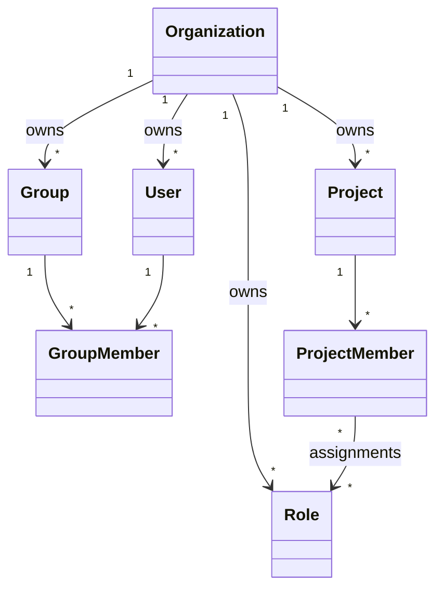

## Entities

```text
Organization
  id
  key
  name

User
  id
  organization_id
  username
  normalized_email
  display_name
  status

Group
  id
  organization_id
  name
  description

GroupMember
  group_id
  user_id

Role
  id
  organization_id
  name
  description

Project
  id
  organization_id
  key
  name
  description
  status

ProjectMember
  id
  project_id
  principal_type = USER | GROUP
  principal_id

ProjectMemberRole
  project_member_id
  role_id
```

## Ownership invariants

- Every User, Group, Role, and Project references exactly one Organization.
- A Group may contain only Users whose `organization_id` equals the Group's `organization_id`.
- Project Membership may reference a User or Group from any Organization.
- A Role assigned to a Project Member must have the same `organization_id` as the Project.
- Creating or deleting Project Membership never changes resource ownership.

## Required uniqueness

- `Organization.key` is unique installation-wide.
- `User.username` is unique installation-wide.
- `User.normalized_email` is unique installation-wide.
- `GroupMember(group_id, user_id)` is unique.
- `Project(organization_id, key)` is unique.
- `ProjectMember(project_id, principal_type, principal_id)` is unique.
- `ProjectMemberRole(project_member_id, role_id)` is unique.

## Project authorization

For a User `U` and Project `P`:

1. Load a direct `ProjectMember` for `U`, if one exists.
2. Load Groups containing `U` that also have `ProjectMember` records for `P`.
3. Union all Roles assigned through those memberships.
4. Union the authorization Statements granted by those Roles.
5. Allow the operation when an effective Statement permits it and the resource-level invariant also passes.

There is no deny rule and no Role inheritance.

## External Group semantics

When an external Group is a Project Member, membership changes made by the Group's owning Organization affect Project
access immediately.

Do not materialize external Group Users into separate Project Membership rows merely for caching. Doing so creates two
sources of truth. Cache effective access only as derived data that can be invalidated when Group membership or Project
Membership changes.

## Transaction boundaries

The following mutations must be atomic:

- add or remove a Group Member;
- add or remove a Project Member;
- change Project Member Role assignments;
- change Role Statement assignments.

Authorization reads must never treat ownership as participation. A User belonging to the Project's Organization has no
Project access unless direct or Group-derived Project Membership grants it.
