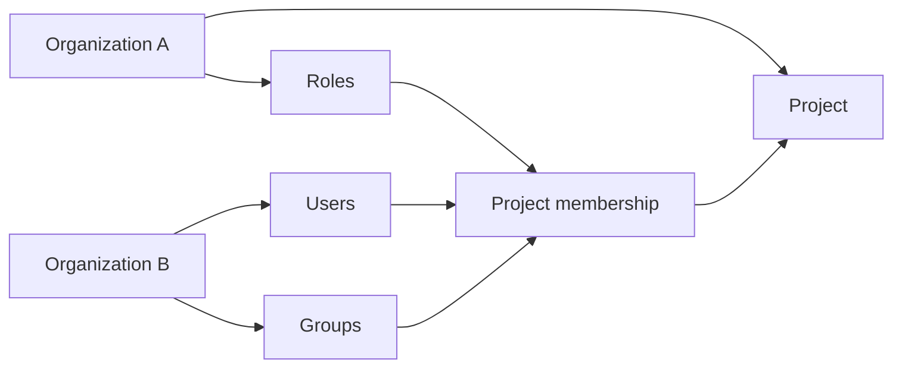

Taskmigo models the people, teams, roles, and projects that companies use to collaborate.
The current contract focuses on resource management before introducing work-tracking features.

The central rule is simple: **ownership and participation are different**.
A resource remains owned by its home Organization even when it participates in another Organization's Project.

- [Product manual](/docs/v0/manuals)
- [Developer resource model](/docs/v0/developer)
