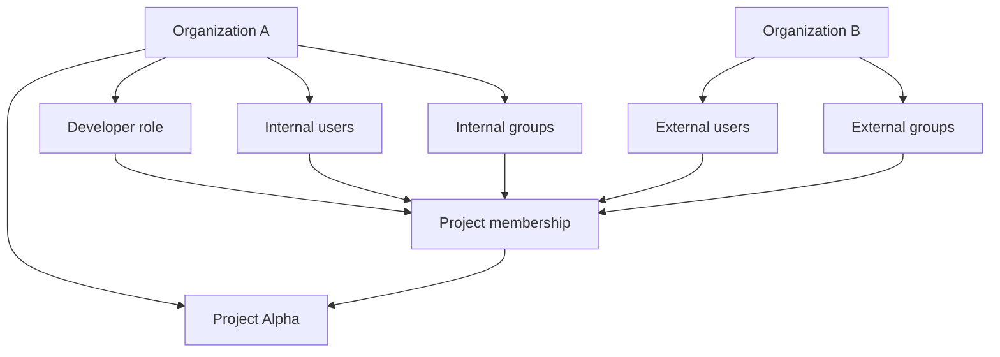

Taskmigo separates **who owns a resource** from **where that resource participates**.
This is the foundation for internal teams and outsourcing companies to work in the same Project model.

## Ownership

Every managed resource has one owning Organization:

- User: one home Organization.
- Group: one owning Organization.
- Role: one owning Organization.
- Project: one owning Organization.

Ownership defines which company manages the resource. It does not automatically grant access to Projects.

## Participation

A Project may include Users and Groups owned by any Organization.
Project Membership references those resources; it never copies them and never changes their owner.

For example, Company A can own a Project while Company B supplies a Group of engineers to that Project.
Company B continues to manage the Group and its Users. Company A controls only the Group's membership and roles in
Company A's Project.

## Authorization

Roles are defined by the Organization that owns the Project.
A Project Member receives one or more of those Roles.

For a User, effective Project roles are the union of:

1. Roles assigned directly to that User's Project Membership.
2. Roles inherited from Groups that contain the User and are also Project Members.

Roles grant authorization Statements. There is no explicit deny.
