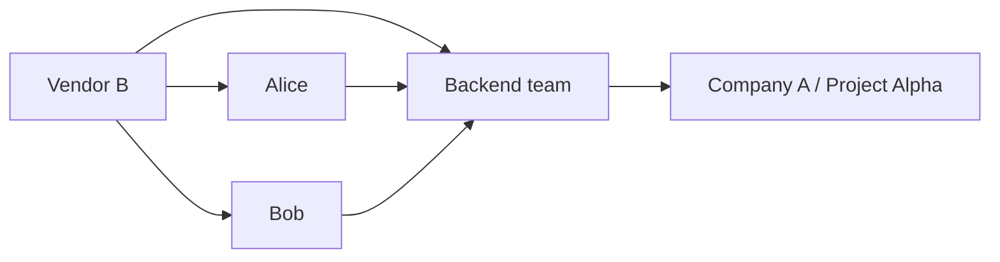

A Group is a reusable collection of Users owned by one Organization.

## Fields

- **ID**: stable internal identifier.
- **Organization**: owning Organization.
- **Name**: human-readable Group name.
- **Description**: optional summary.

## Membership rules

A Group contains Users only from the same Organization as the Group.
Nested Groups are not supported.

This keeps resource ownership explicit and prevents a Group from silently becoming a second cross-organization
ownership model.

## Project staffing

A Group can become a Project Member in a Project owned by the same or another Organization.
Every current User in that Group receives the Project roles assigned to the Group membership.

Using an external Group means the Project owner trusts the Group's owning Organization to manage that roster.
Adding or removing a User from the Group immediately changes the User's group-derived Project access.

If the Project owner needs a fixed external roster, add the external Users as individual Project Members instead.
