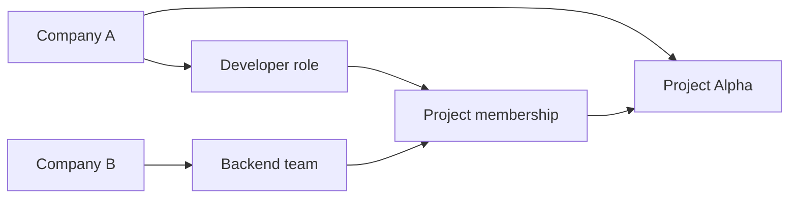

An Organization represents a company or other entity that owns and manages resources in Taskmigo.
It is an ownership boundary, not a Project permission scope.

## Fields

- **ID**: stable internal identifier.
- **Key**: stable, installation-unique identifier used to distinguish Organizations.
- **Name**: human-readable Organization name.

## Owned resources

An Organization owns:

- Users whose home Organization is that Organization.
- Groups created by that Organization.
- Roles defined by that Organization.
- Projects created by that Organization.

A resource has exactly one owner in the current model.

## Cross-organization collaboration

Organization ownership does not restrict Project staffing to internal resources.
A Project may include Users or Groups from another Organization.

The Backend team remains owned by Company B. Company A does not receive ownership of the team or its Users.

## What Organization does not mean

Being part of an Organization does not automatically grant access to every Project owned by that Organization.
Project access is granted through Project Membership and Roles.

Organization-level administration and SSO configuration are separate concerns and are not defined by the current
resource-management contract.
