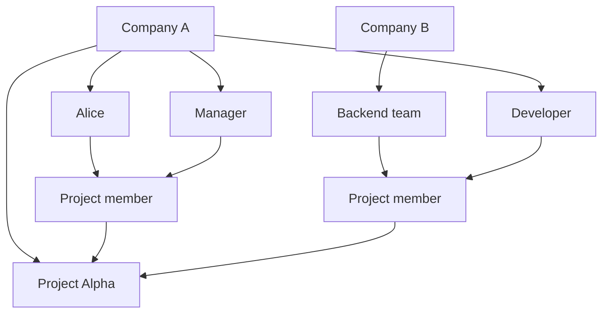

A Project belongs to one Organization and defines which Users and Groups participate in that Project.

## Fields

- **ID**: stable internal identifier.
- **Organization**: owning Organization.
- **Key**: short identifier unique within the owning Organization.
- **Name**: human-readable Project name.
- **Description**: optional summary.
- **Status**: `ACTIVE` or `ARCHIVED`.
- **Archived at**: timestamp recorded when the Project enters `ARCHIVED` state.

Project ownership is fixed in the current model. Moving a Project between Organizations requires separate transfer
semantics and is not a normal Project update.

## Project Membership

A Project Member references exactly one principal:

- a User; or
- a Group.

The principal may belong to any Organization.
Each Project Member has one or more Roles owned by the Project's Organization.

## Ownership versus participation

Adding Company B's Backend team to Project Alpha does not copy the Group into Company A.
It creates only Project Membership that references the existing Group.

Removing that membership removes the Group's participation in Project Alpha but leaves the Group and its Users under
Company B.

## Archive behavior

Archiving a Project is a one-way transition to read-only mode. The Project, its memberships, and role assignments remain
available for historical inspection but ordinary mutations are rejected.

Archived Projects are permanently deleted after the configured retention period. The worker checks expired archives
periodically and deletes the Project together with Project-owned memberships, role assignments, and history.

The default retention period is 30 days. Configure it with `TASKMIGO_PROJECT_RETENTION_DAYS`. The worker cleanup interval
defaults to one hour and can be changed with `TASKMIGO_PROJECT_RETENTION_CLEANUP_INTERVAL` using a Spring duration such as
`PT6H`.
