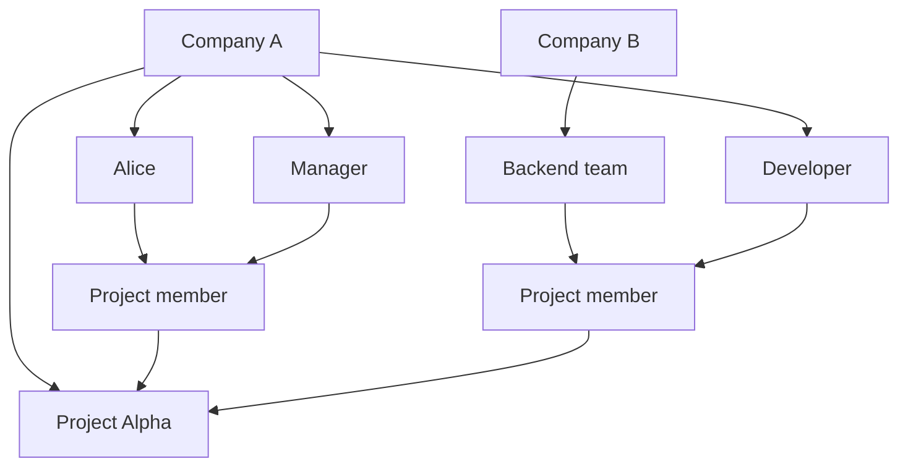

A Project belongs to one Organization and defines which Users and Groups participate in that Project.

## Fields

- **ID**: stable internal identifier.
- **Organization**: owning Organization.
- **Key**: short identifier unique within the owning Organization.
- **Name**: human-readable Project name.
- **Description**: optional summary.
- **Status**: `ACTIVE` or `ARCHIVED`.

Project ownership is fixed in the current model. Moving a Project between Organizations requires separate transfer
semantics and is not a normal Project update.

## Project Membership

A Project Member references exactly one principal:

- a User; or
- a Group.

The principal may belong to any Organization.
Each Project Member has one or more Roles owned by the Project's Organization.

## Ownership versus participation

Adding Company B's Backend team to Project Alpha does not copy the Group into Company A.
It creates only Project Membership that references the existing Group.

Removing that membership removes the Group's participation in Project Alpha but leaves the Group and its Users under
Company B.

## Archive behavior

An archived Project is read-only for ordinary Project mutations.
Its ownership, memberships, and role assignments remain available for historical inspection.
