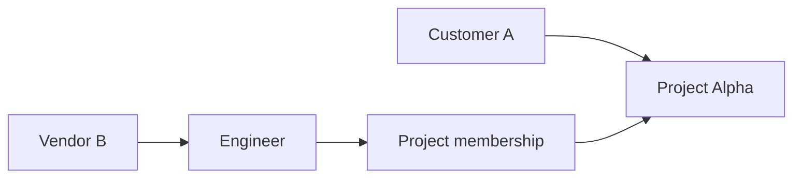

A User represents one person in a Taskmigo installation.

## Fields

- **ID**: stable internal identifier.
- **Organization**: the User's single home Organization.
- **Username**: installation-unique login or display handle.
- **Email**: installation-unique normalized email address.
- **Display name**: human-readable name.
- **Status**: `ACTIVE`, `SUSPENDED`, or `DISABLED`.

A User has one home Organization. The home Organization expresses resource ownership; it does not limit the User to
Projects owned by that Organization.

## Cross-organization participation

A User may participate directly in Projects owned by other Organizations.

The Engineer remains owned by Vendor B while participating in Project Alpha.
Removing the Project Membership removes participation only; it does not change the User's home Organization.

## Authentication

Authentication is outside the current resource model.
The home Organization can later provide context for SSO or identity-provider discovery without changing Project
Membership semantics.
